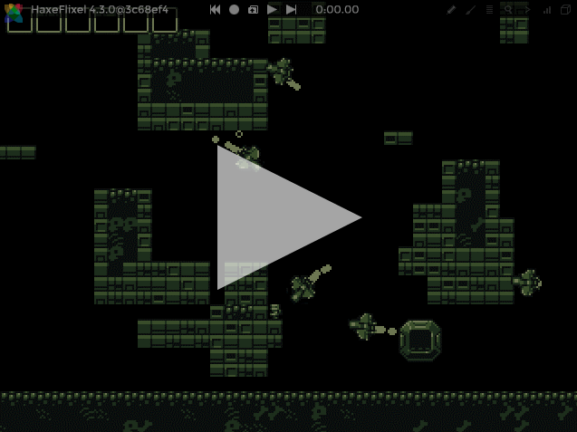
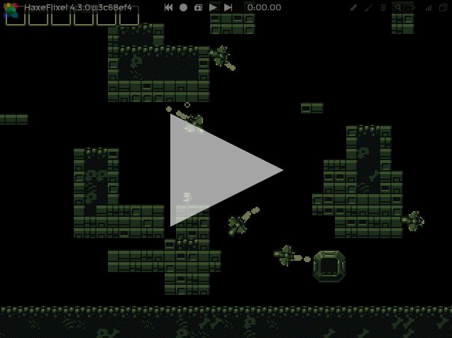

```
title: "Debugger - Interaction"
```

The interaction tool (enabled by the  button in the debugger overlay) allows you to change game elements, e.g. move sprites, while the game is still running.

It is highly recommended, however, that you pause the game using VCR's pause button  before using the interaction tool. You can always resume the game by clicking VCR's play button  after you are done with the interaction. If the game is not paused during the interaction, objects affected by acceleration, for instance, will continue to move, making your work harder.

## Interaction tools

When the interaction is enabled, a toolbar containing a few related tools is displayed on the left side of the screen. Below is a description of each tool.

### Pointer

The pointer tool  allows you to select game elements. In order to use it, simply click elements on the screen:


Currently only elements that extend `FlxSprite` can be selected (which exclude tiles of a tilemap, for instance). Elements that belong to your selection will be highlighted in red. If you click an empty space, the selection will be discarded.

You can add/remove elements to/from your existing selection by holding `CTRL` when you click elements. It is also possible to add/remove a group of elements by clicking and dragging the mouse cursor to create a selection area:



If you press the `DELETE` key when elements are selected, the debugger will invoke the `kill()` method of each element in that selection. You can also press `DELETE` while holding `SHIFT` to invoke the `kill()` method and additionally remove the elements from memory, i.e. elements will be removed from Flixel's display list.

### Mover

The mover tool  allows you to move game objects that were selected by the pointer tool. In order to use this functionality, select any element(s) using the pointer tool, then pick the mover tool and click-and-drag *anywhere* on the screen:


The selected elements will follow the movement of the mouse cursor until you release the mouse button.

The mover tool is also activated while the `SHIFT` key is kept pressed, so you can move selected elements at any time, even when any other tool is active. After performing a selection, hold `SHIFT` then click-and-drag anywhere on the screen to move the selected element(s):



When you stop pressing `SHIFT`, the element(s) will stop moving and your previously active tool will become effective again.
